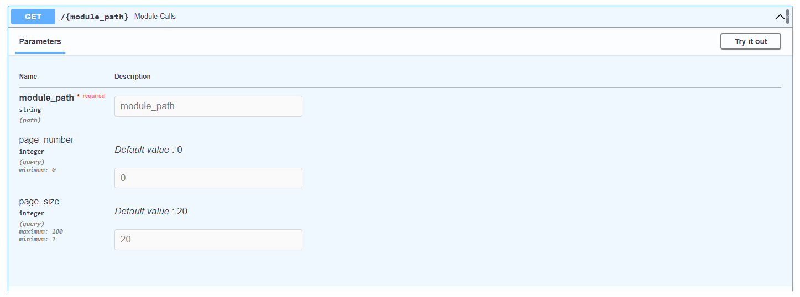
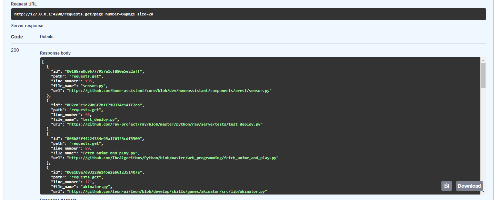

# Code hints!
- **Python module parser:** Search for all the callables with full path of a package or module

- **GitHub scraper:** Download the top Python repositories from GitHub

- **FastAPI endpoint:** API that gaves you real code examples from a callable path string

## Usage

### Scraper
Set all the enviromentals like [.env.example](.env.example).  
Run it :D  

```console
$ python main.py
```

### API
Test it with
```console
$ uvicorn api.start:app --reload --port 4200
```
  
